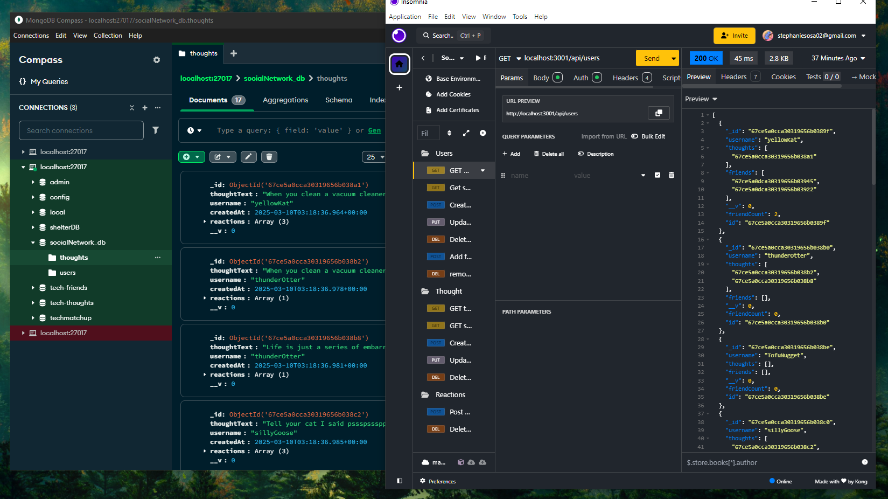

# Social-Network-API
## Description
This is a backend API for a social network, allowing users to create profiles, share thoughts, react to friends' posts, and manage friend lists dynamically. It's build with **Express**, **MongoDB**, and **Mongoose**, this project demonstrates NoSQL database management and API routing.

[Click here](https://drive.google.com/file/d/1lItB6cgZ6W2mxYgQVntpfBlbiKO0kxvy/view) to watch a video walkthrough!

## Table of Contents

- [Installation](#installation)
- [Usage](#usage)
- [Credits](#credits)
- [License](#license)

## Installation

For installation follow these steps:
- Git clone the repository
- Install the dependency with `npm install`
- Set up the database connection in `.env`
```sh
MONGODB_URI='mongodb://your_server_name:27017/your_db_name'
```
- *(Optional)* Seed the database with test data: `npm run seed`
- start the server in your terminal: `npm start`

## Usage
Test the API using *Insomnia* & connect to *MongoDB database* for data storage.



### Users routes
* `GET /api/users` Gets all users
* `GET /api/users/:userId` Grabs a single user by ID
* `POST /api/users` Creates a new user
* `PUT /api/users/:userId ` Updates the user
### Friends routes
* `DELETE /api/users/:userId` Deletes the user
* `POST /api/users/:userId/friends/:friendId` Adds a friend to user's friend list
* `DELETE /api/users/:userId/friends/:friendId` Removes a friend from user's friend list
### Thoughts routes
* `GET /api/thoughts` Get all thoughts
* `GET /api/thoughts/:thoughtId` Grabs a single thought by ID
* `POST /api/thoughts` Creates a new thought
* `PUT /api/thoughts/:thoughtId` Updates the user's thought
* `DELETE /api/thoughts/:thoughtId` Deletes the thought
### Reaction Routes
* `POST /api/thoughts/:thoughtId/reactions` Adds a reaction
* `DELETE /api/thoughts/:thoughtId/reactions/:reactionId` Deletes the reaction


## 📜License

This application is covered under [](https://opensource.org/licenses/MIT)

## Features

✅ Create,update, delete accounts 

✅ Add/remove friends

✅ Thoughts can be created, updated, and deleted

✅ Thoguhts do have reactions

✅ Reactions can be added and removed on thoughts

## How to Contribute
🚀 Developed by [stephanuh](https://github.com/stephanuh)